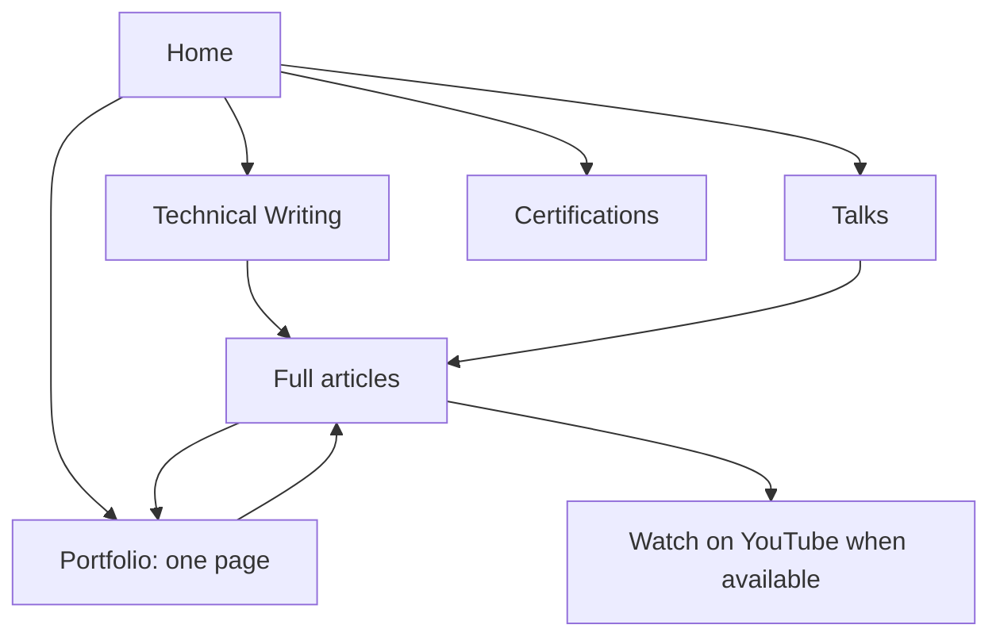

# Whole-site redesign: review brief

Status: planning only. User requirements below are confirmed; proposed labels, URLs and sequencing remain recommendations. No production pages changed.

## Confirmed direction

- Apply design system v3 across every page, including Certifications.
- Retire the current blogs.html experience and outbound LinkedIn content cards.
- Keep Light / Dark / System and the portfolio as a separate single-page experience.
- Remove every Book a talk action and the Follow the work closing band.
- Use a compact footer with profile links. LinkedIn is required; GitHub is acceptable, with LinkedIn-only also acceptable.
- Give talks their own section and destination, separate from certifications.
- All writing lives on this domain. Watching a video goes to YouTube.
- Every video carried into the new listing requires a complete written companion. A summary or raw transcript alone does not satisfy this requirement.
- Topic filters update the current listing without navigating or reloading. Keep sorting.
- Launching with zero published writing entries is acceptable.
- Reconsider AEM + AI as a navigation destination because its meaning overlaps other topics.

## What the review found

Reviewed the v3 home, blog and post templates in the browser, their source, PRODUCT.md, README.md, the existing site and content plans, and docs/site-operations.md. Active workspace: /Users/jackjin/dev/jackzhaojin.github.io.

The warm paper, serif headings, dark palette, section bands and theme control provide an established visual direction. Reuse that system. The listing currently puts a lengthy introduction, featured piece and counts table ahead of the results. Reduce that preamble so readers reach the filter controls and writing sooner.

The templates and older plans disagree in places about whether cards already link to on-site posts. The reviewed browser listing still links to LinkedIn. Topic controls are links; format/type controls operate in place. Standardize their behavior.

The current blogs.html and the shared data both contain 39 items: 7 articles, 13 short posts and 19 videos. The shared dataset also contains 22 credential records and 6 talk records; some talk dates and titles remain provisional. These are inventory counts, not counts of publish-ready content.

Impeccable reported that its design.json sidecar is older than DESIGN.md. This review uses the actual templates and DESIGN.md; no tooling repair is included.

## Installed SEO/GEO skills

Claude's five SEO-related skill paths are symlinks to the same project .agents/skills files available to Codex. They are shared instructions, not separate implementations.

| Skill | Installed source | Role in this work |
| --- | --- | --- |
| seo-audit | .agents/skills/seo-audit/SKILL.md | Crawlability, page metadata, canonical URLs, sitemap, redirects and content review |
| ai-seo | .agents/skills/ai-seo/SKILL.md | GEO/AEO: useful source material, clear answers, authorship, references and AI discovery |
| schema | .agents/skills/schema/SKILL.md | Structured data describing visible articles, author and breadcrumbs |
| site-architecture | .agents/skills/site-architecture/SKILL.md | Navigation, page hierarchy and internal links |
| programmatic-seo | .agents/skills/programmatic-seo/SKILL.md | Available for substantive data-driven collections later; unnecessary for a small initial archive |

Skill advice needs judgment. Claimed citation multipliers, mandatory AI files and blanket crawler permissions are not adopted as guarantees or launch requirements. Search retrieval access and model-training permission need separate treatment.

## Proposed page list

| Page | Proposed URL | Purpose | Navigation |
| --- | --- | --- | --- |
| Home | / | Introduce Jack and show selected work, writing, talks and credentials | Wordmark |
| Technical Writing | /writing/ | Searchable, filterable and sortable list of full on-site articles | Header |
| Article | /writing/{slug}/ | Complete explanation with evidence; optional YouTube watch link | Writing list and related links |
| Portfolio | /portfolio/ | Existing continuous project experience, restyled with v3 | Header |
| Talks | /talks/ | Talk history, event/date, subject, slides and relevant writing | Header and home section |
| Certifications | /certifications/ | Credential collection with issuer and verification links | Header and home section |

```text
Home (/)
|-- Technical Writing (/writing/)
|   `-- Article (/writing/{slug}/)
|-- Portfolio (/portfolio/, existing chapter anchors)
|-- Talks (/talks/)
`-- Certifications (/certifications/)
```



Header order: Technical Writing, Portfolio, Talks, Certifications, theme control. No booking button. Home provides the personal introduction; a separate About page can follow when it has useful additional content.

Footer recommendation: copyright, LinkedIn, GitHub, plus any necessary utility link. No marketing band, topic directory, machine-files directory or implementation tagline.

Home sequence: brief introduction; selected portfolio work; latest writing when any exists; a distinct Talks section; selected credentials; compact footer. Use View portfolio as the main action while writing is empty.

Preserve /portfolio/ and every existing #ch-* anchor. Deliver its text in HTML and retain its page interactions. A single-page experience does not require a new framework or client-rendered content.

## Writing listing specification

- Heading: Technical Writing. Suggested short introduction: "Practical notes on AI engineering, Adobe Experience Manager, and working with AI."
- Navigation label may be shortened to Writing if the full label crowds the mobile menu. Keep one consistent choice in the implementation.
- Use compact editorial rows: linked title, brief description, date, topic labels, optional Video available indicator, and reading time only when calculated from the complete article.
- Title and primary Read article link always open the on-site article. A separately labeled Watch on YouTube link may appear when both article and verified video URL are ready. Avoid nested links in a whole-row anchor.
- Start with topic filters: All, Adobe AEM & EDS, AI Engineering, Working with AI. Final assignment is an editorial check, not an automatic conversion of the old AI label.
- An article may belong to multiple topics. Choose one active topic for a simple first version. Add an optional With video toggle when the published collection warrants it.
- Remove the old Article / Post / Video split: those describe the old publishing channels more than the new reading experience. Add further filters only when they help readers distinguish the actual collection.
- Provide text search across titles and summaries when enough articles exist to make it useful.
- Sort: newest first by default, oldest first, title A-Z. Use original publication date for migrated pieces; show a separate updated date for meaningful changes.
- All filters and sorting operate on this page, preserving focus and scroll. Expose a clear selection state, result count and Clear filters control. Announce count changes accessibly.
- Encode optional shareable filter state in a URL fragment, such as /writing/#topic=ai-engineering. Support restoration and browser Back/Forward. Article paths remain ordinary crawlable URLs.
- Initial HTML contains the complete published listing and article links. With JavaScript disabled, the full list remains readable; inactive controls should not mislead users.
- Zero published items: show a short honest empty state and a Portfolio link. Hide search, filters, counts table and featured article. Do not render the old 39 records as if they were already migrated.
- Zero matching items: explain that the selected filters found no matches and offer Clear filters.
- One or two items: show the writing directly with no oversized filter area. Introduce controls as the collection grows.

## Videos and written content

Recommendation: keep videos within Technical Writing as an optional way to consume a subject. Do not create a separate Videos destination at launch.

Each retained video needs a standalone article covering the problem, context, approach, important steps or diagrams, tradeoffs, results and sources. Choose sections that fit the material; do not force a facts table or FAQ onto every article. Verify dated product claims and explicitly identify changed behavior since the recording.

Use the original recording date for the video. A genuinely new written treatment may have a new article publication date, with its relationship to the older video stated. A simple migration retains its original date.

The article can link to YouTube near the introduction, with an optional embed farther down. The article must be complete without playing the video. A transcript can supplement the article. No video enters the public writing list before its full written companion exists; no Watch link appears until its actual YouTube URL is verified.

Inventory is separate from publishing eligibility. Old short announcements may fit Talks or the personal introduction better than Technical Writing. Preserve source material, then decide disposition after reading it. Do not expand an announcement into a technical article using invented substance.

## AEM + AI and search

Recommendation: remove AEM + AI from primary navigation and remove the four-hub block from the initial homepage. Keep Adobe Experience Manager and AI terminology in relevant titles, prose and article topics. A later guide such as "Using AI agents with Adobe Experience Manager" is useful only if it answers a real reader question with substantial original material.

Google says its AI search features use the existing SEO foundations and require no special AI files or markup. That supports prioritizing complete text, discoverable links, useful evidence and accurate structured data. It does not establish that any particular navigation label will improve rankings. [Google AI features guidance](https://developers.google.com/search/docs/appearance/ai-features).

Google also documents the crawl problems caused by filter URL combinations and explicitly lists fragments as an option when those views do not need indexing. Keep the collection and articles indexable, with filter states serving readers. [Faceted navigation guidance](https://developers.google.com/crawling/docs/faceted-navigation).

Video search is a separate consideration: Google distinguishes dedicated watch pages from articles with supplementary video. The proposed article-first layout prioritizes reading and text discovery; it does not promise video-rich results. YouTube provides the watch destination. [Google video guidance](https://developers.google.com/search/docs/appearance/video).

Launch foundations: unique titles and descriptions; semantic headings; accurate author information and dates; relevant internal links; visible content available in initial HTML; matching Article/Person/Breadcrumb structured data where appropriate; canonical URLs; sitemap; working analytics and search verification; responsive and keyboard-accessible pages.

llms.txt and Markdown exports can be evaluated later as optional conveniences. No promised ranking or citation benefit. No required FAQ counts, fixed answer lengths or automatically generated topic pages.

## Proposed build sequence

1. Reconcile PRODUCT.md, the SEO site plan, page blueprint and v3 templates with the confirmed requirements. The old ordinary-video summary exception and booking actions must be removed.
2. Apply the shared header, footer and theme system; build Home, Writing (including empty state), Talks and Certifications; restyle Portfolio in place.
3. Build one article template using actual source content. Keep plain HTML/CSS/JS. Do not introduce a generator or build pipeline under this brief; that is a separate implementation decision under the repository's no-build constraint.
4. Audit the 7 articles and 13 short posts in career-blogs. Publish selected complete material; keep drafts out of public listings.
5. Rewrite the 19 video candidates progressively. Verify recordings, transcripts, images and YouTube destinations before publishing each companion. The backlog need not delay the new site.
6. At cutover, implement and verify a permanent redirect from /blogs.html to /writing/ and from /certifications.html to /certifications/. Use the documented hosting mechanism; an HTML stub alone is not an HTTP 301. Preserve any relevant existing certification fragment targets.
7. Preserve CNAME, .nojekyll, GA4 and both Search Console verification artifacts. Follow docs/site-operations.md for metadata, sitemap and deployment checks. Demo pages remain noindex. Commit and push only when explicitly instructed.

## Review limits

This is an architecture and content brief, not a full SEO audit, completed redesign, keyword-demand study or ranking forecast. Full content in career-blogs and YouTube availability have not yet been audited. Proposed topics, /writing/ URLs, GitHub footer inclusion and article selection are recommendations.
